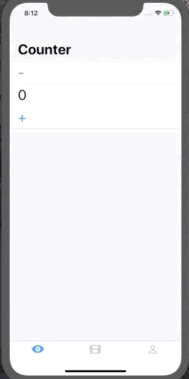

# CombineFeedback

Unidirectional Reactive Architecture. This is a [Combine](https://developer.apple.com/documentation/combine) implemetation of [ReactiveFeedbback](https://github.com/Babylonpartners/ReactiveFeedback) and [RxFeedback](https://github.com/kzaher/RxFeedback)

## Diagram

## Motivation

Requirements for iOS apps have become huge. Our code has to manage a lot of state e.g. server responses, cached data, UI state, routing etc. Some may say that Reactive Programming can help us a lot but, in the wrong hands, it can do even more harm to your code base.

The goal of this library is to provide a simple and intuitive approach to designing reactive state machines.

## Core Concepts

### State 

`State` is the single source of truth. It represents a state of your system and is usually a plain Swift type. Your state is immutable. The only way to transition from one `State` to another is to emit an `Event`.

### Event

Represents all possible events that can happen in your system which can cause a transition to a new `State`.

### Reducer 

A Reducer is a pure function with a signature of `(State, Event) -> State`. While `Event` represents an action that results in a `State` change, it's actually not what _causes_ the change. An `Event` is just that, a representation of the intention to transition from one state to another. What actually causes the `State` to change, the embodiment of the corresponding `Event`, is a Reducer. A Reducer is the only place where a `State` can be changed.

### Feedback

While `State` represents where the system is at a given time, `Event` represents a state change, and a `Reducer` is the pure function that enacts the event causing the state to change, there is not as of yet any type to decide which event should take place given a particular current state. That's the job of the `Feedback`. It's essentially a "processing engine", listening to changes in the current `State` and emitting the corresponding next events to take place. It's represented by a pure function with a signature of `(AnyPublisher<State, Never>) -> AnyPublisher<Event, Never>`. Feedbacks don't directly mutate states. Instead, they only emit events which then cause states to change in reducers.

### UI as a Feedback 🤯

This repo contains an [example](CombineFeedbackUI/SwiftUIFeedback.swift) of UIFeedback loop inspired by the work of [@Krunoslav Zaher](https://twitter.com/KrunoslavZaher) in [RxFeedback-React](https://github.com/NoTests/RxFeedback-React) specifically [here](https://github.com/NoTests/RxFeedback-React/blob/master/src/index.ts#L37)

##### Example

| Counter | Movies |
| --- | --- |
| |  |

##### More examples to come stay tuned 🚀
